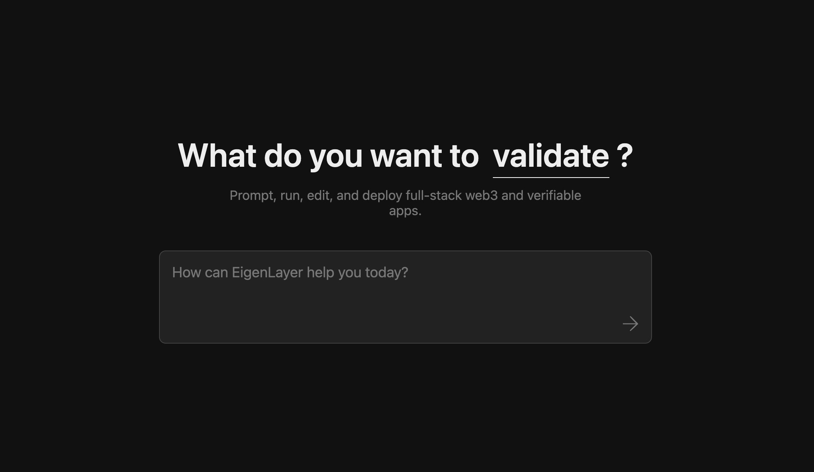
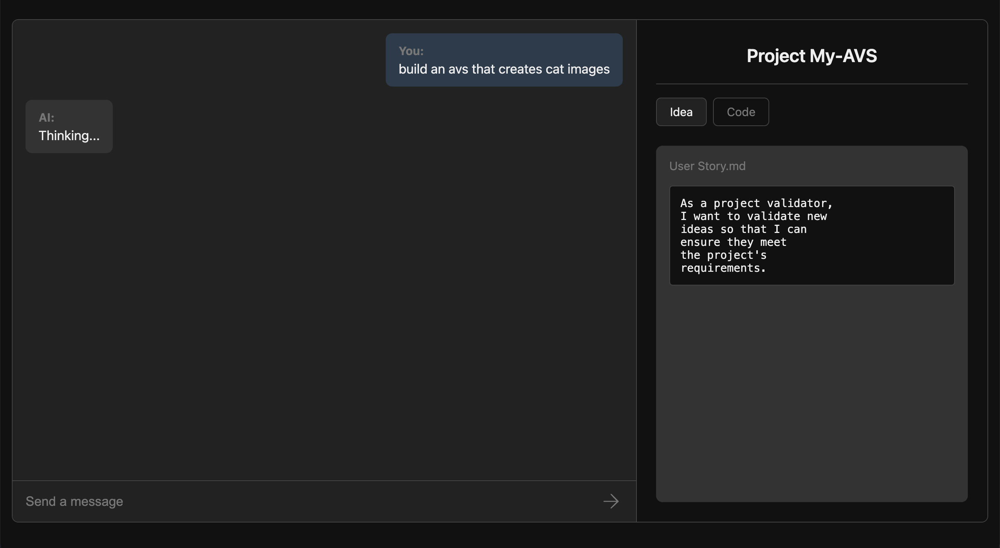

# VibeAVS - AI Chat Experience

A React-based web application that provides a seamless AI chat experience powered by Gemini 2.5 Pro.

## Features

- Modern, responsive UI with smooth transitions
- Seamless landing page to chat experience
- Streaming AI responses for real-time interaction
- Support for conversation history

## Tech Stack

- React
- TypeScript
- CSS Modules for styling
- AI SDK for chat integration
- Google Gemini API

# Screenshots

  
*Landing page with smooth transitions and modern design*


  
*Interactive chat interface with streaming responses*


## Getting Started

### Prerequisites

- Node.js 18+ installed
- Google Generative AI API key

### Installation

1. Clone the repository
```
git clone https://github.com/yourusername/vibeavs.git
cd vibeavs
```

2. Install dependencies
```
npm install
```

3. Create a `.env` file in the root directory (use `env.example` as a template)
```
GOOGLE_GENERATIVE_AI_API_KEY=your_api_key_here
```

## Development

There are two ways to run the application:

### Option 1: Separate servers for development

For development with hot-reloading of the React components:

```
npm start
```

This starts the React development server on port 3000. API requests will be proxied to port 3001.

In a separate terminal, run the API server:

```
node server.js
```

### Option 2: Combined build and serve

To create a production build and serve it:

```
npm run dev
```

This command builds the React app and starts the Express server which serves both the static files and the API.

## Project Structure

- `/public` - Static assets
- `/src` - React application code
  - `/components` - React components
  - `/styles` - CSS modules for styling

## Commands

- `npm start` - Start React development server
- `npm run build` - Build for production
- `npm run serve` - Start the Express server
- `npm run dev` - Build and serve in one command
- `npm run lint` - Run linting checks

## License

This project is licensed under the ISC License - see the [LICENSE](LICENSE) file for details.